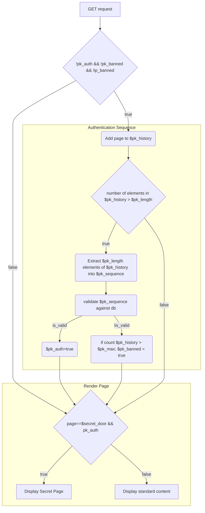
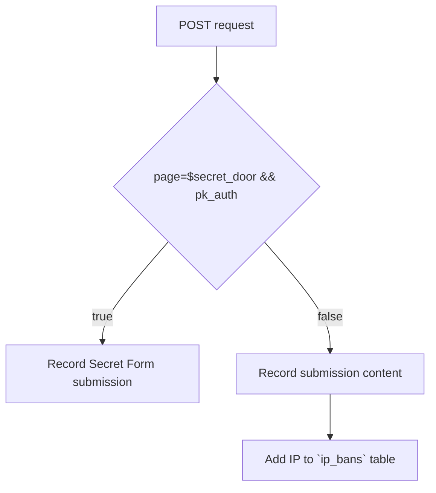

# Secret Garden

A two part web application:
- Collection portal: for the collection of information hidden behind a page knocking mechanism that can be deployed across multiple domains.
- Admin portal: for the management of collected information

## 🌿 Core Philosophy

- **Minimalism**: No external frameworks. Clean, readable code that is easy to audit and maintain.
- **Stealth**: Authentication is hidden behind behavioral sequences (Page Knocking) rather than standard login gates. The goal is for the portal to be so unremarkable that it is dismissed by human and automated observers alike.
- **Layered Reality**: The system acts as a dynamic reality bridge. For the public, it is a simple gardening site; for authorized users, it is a secure registration system unlocked only by intent and behavior.
- **Digital Resiliency**: By using native PHP and PostgreSQL with zero external upstream dependencies, the portal is immune to supply chain attacks and ensures long-term stability in scrutinized environments.
- **Privacy as a Service**: The system ensures the very existence of a user base or registration list remains non-obvious to external observers.

### Why Stealth?

Traditional login pages (`/admin`, `/login`) are primary targets for automated brute-force attacks and manual discovery. By using **Page Knocking**, the authentication interface simply does not exist for the average visitor or discovery bot.

This architectural choice creates a protective "Safe Harbor." It manifests only when a specific, predefined interaction pattern is detected, allowing for secure coordination while maintaining a public persona as a simple, static portal.

---

## 🛡️ Security & Stealth Mechanisms

---

## 🛠️ Technical Stack

- **Web Server**: Nginx with PHP-FPM.
- **Database**: PostgreSQL with custom roles and Row-Level Security.
- **Backend**: Clean PHP (No Frameworks).
- **Frontend**: Minimal HTML. No CSS frameworks, no responsive design.

---

## ⚙️ Configuration

### PHP Constants (`source/config/config.php`)

- `ENVIRONMENT`: `development` (debug tools on) or `production` (stealth mode).
- `DATABASE_HOST`: PostgreSQL container hostname.
- `DATABASE_NAME`: Target database name.
- `DATABASE_USER / PASSWORD`: App-logic user credentials.
- `DATABASE_USER_MASTER_NAME / PASSWORD`: Database owner credentials.

### PHP Constants (`source/config/config.php`)

Application specific configuration:
- `PK_LENGTH`: Length of correct knocking sequence (Default: `5`).
- `PK_MAX_HISTORY`: Max visits before session lockout (Default: `10`).
- `GENERATED_PASSWORD_LENGTH`: Length of the password generated for new users (Default: `10`).
- `SECRET_DOOR_ID`: The ID of the page where the Secret Door is located (Default: `2`).
- `SECRET_PAGE_ID`: The ID of the hidden registration template (Default: `7`).
- `PAGES`: Source of truth for all valid routes and metadata.

---

## 🚀 Getting Started

TODO
