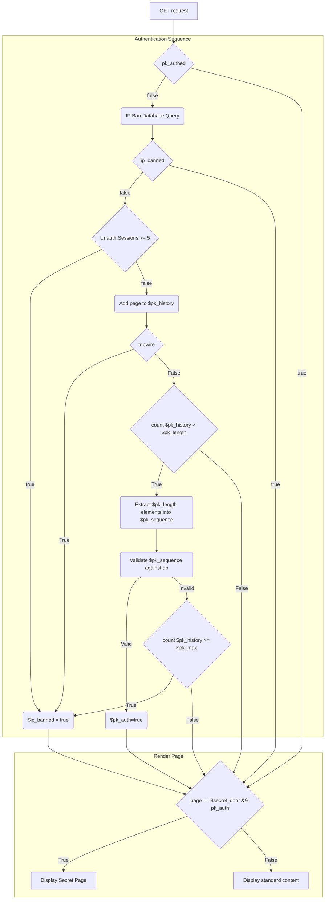
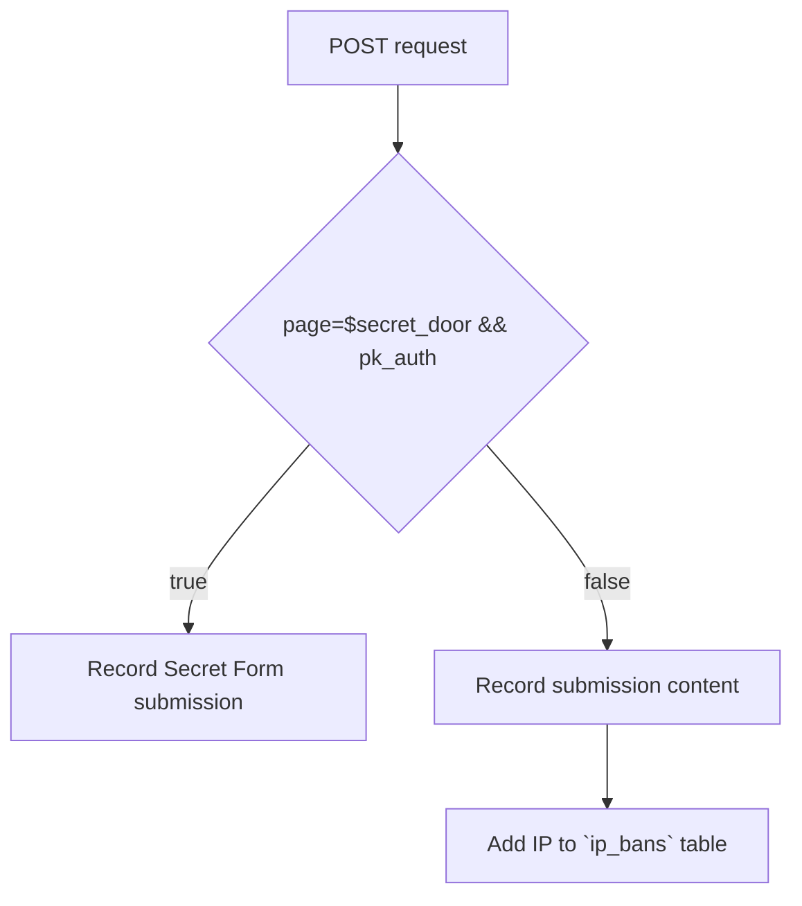

# Secret Garden

A two part web application:
- Collection portal: for the collection of information hidden behind a page knocking mechanism that can be deployed across multiple domains.
- Admin portal: for the management of collected information

## 🌿 Core Philosophy

- **Minimalism**: No external frameworks. Clean, readable code that is easy to audit and maintain.
- **Stealth**: Authentication is hidden behind behavioral sequences (Page Knocking) rather than standard login gates. The goal is for the portal to be so unremarkable that it is dismissed by human and automated observers alike.
- **Layered Reality**: The system acts as a dynamic reality bridge. For the public, it is a simple gardening site; for authorized users, it is a secure secret page system unlocked only by intent and behavior.
- **Digital Resiliency**: By using native PHP and PostgreSQL with zero external upstream dependencies, the portal is immune to supply chain attacks and ensures long-term stability in scrutinized environments.
- **Privacy as a Service**: The system ensures the very existence of a user base or secret page list remains non-obvious to external observers.

### Why Stealth?

Traditional login pages (`/admin`, `/login`) are primary targets for automated brute-force attacks and manual discovery. By using **Page Knocking**, the authentication interface simply does not exist for the average visitor or discovery bot.

This architectural choice creates a protective "Safe Harbor." It manifests only when a specific, predefined interaction pattern is detected, allowing for secure coordination while maintaining a public persona as a simple, static portal.

---

## 🛡️ Security & Stealth Mechanisms





---

## 🛠️ Technical Stack

- **Web Server**: Nginx with PHP-FPM.
- **Database**: PostgreSQL with custom roles and Row-Level Security.
- **Backend**: Clean PHP (No Frameworks).
- **Frontend**: Minimal HTML. No CSS frameworks, no responsive design.

## 🚀 Getting Started

Follow these steps to configure, build, and deploy the Secret Garden environment.

### 📝 Phase 0: Planning & Scoping

**Complete this step before configuring the software.** You need a clear map of your network infrastructure and content strategy to properly configure `init.yaml`.

#### 1. Define Deployment Scope
Determine the scale of your operation:
* **User Pool**: How many actual users, will ther be? How many usernames (`num_generated_usernames`) should be pre-generated?
* **PK Sequences**: How many unique access keys do you need?
* **Network Size**: How many distinct public-facing websites will you deploy? It is recommended that no more than 100 actual users use each public site.
* **Data Collection**: Define the fields required for `secret_page_submissions` (e.g., "what data are we actually collecting from agents?").

#### 2. Content Generation (Per Public Site)
For **each** public website, create a blueprint. You should aim for 5-9 pages. The current page knock setup does not permit more than 9 pages (excluding secret door).

**Site Blueprint Template:**
* **Domain Name**: (e.g., `northern-lights-logistics.com`)
* **Visual Theme**: (e.g., "Corporate/Clean", "Industrial", "Retro/Terminal")
* **Content Theme**: (e.g., "International Shipping", "Lifestyle Blog", "Software Documentation")

**Page Structure:**
*Draft 5-9 pages. Assign a "Short Name" for the menu (URL slug) and a brief description.*

| # | Short Name | Page Title | Purpose / Content Sketch |
| :--- | :--- | :--- | :--- |
| 1 | `home` | Home | Landing page, credibility statement. |
| 2 | `about` | About Us | Company history or bio. |
| 3 | `services` | Services | List of fake services offered. |
| 4 | `news` | Latest News | Generic updates to look active. |
| 5 | | | |
| 6 | | | |
| 7 | | | |
| 8 | `contact` | Contact | Generic form. |

#### 3. Register Domains

### Phase 1: 🛠️ Staging

The project uses a build system to generate site-specific PHP code and custom database schemas from a single configuration file.

#### 1. Clone the Repository

```bash
git clone https://github.com/bok-album-polo/secret-garden.git
cd secret-garden
```

#### 2. Configure the Environment

Copy the example configuration and customize it to match your deployment needs (domains, secrets, database credentials).
```bash
cp service/init-example.yaml service/init.yaml
nano init.yaml
```

#### 3. Run the Build Script

This script parses `init.yaml` and generates the `build/` directory containing all deployable artifacts. An alternative to `init.yaml` can be specified as an argument.
```bash
python3 service/scripts/init.py
```

#### 4. Customize Site Design & Content
Navigate to each generated site directory (e.g., `build/01-domain-name/`) to apply your themes and content.

* **Global Layout** (`src/Views/layout/template.php`):
    Contains the HTML skeleton, `<head>`, navigation menu, and footer. Edit this to apply your visual theme.
* **Page Content** (`src/Views/pages/`):
    Contains the PHP files for individual pages (e.g., `home.php`, `about.php`). These correspond to the "Short Names" defined in your planning phase.
* **Static Assets** (`static/`):
    Place images, CSS, and JavaScript here. They are served publicly at the `/static/` endpoint (e.g., `<link href="/static/style.css">`).

### Phase 2: 🚢 Deployment

TODO..
